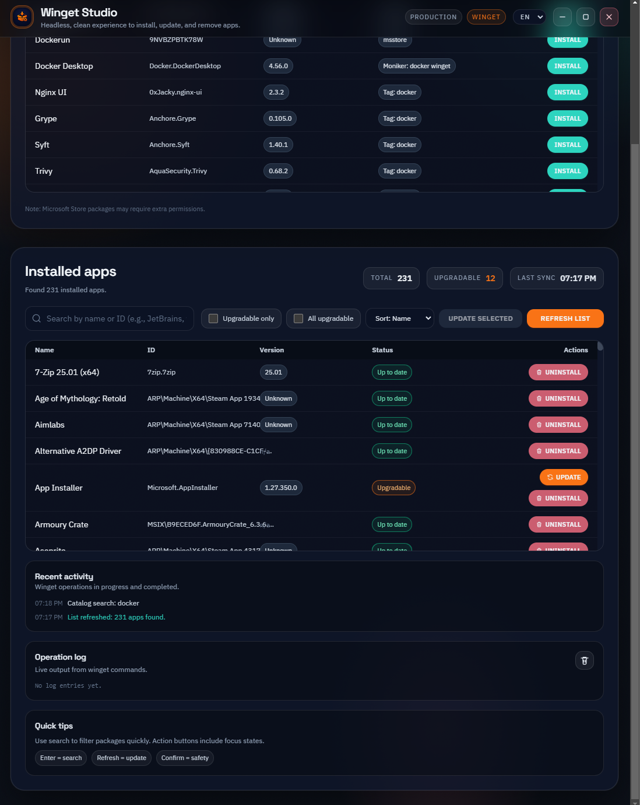

# Winget Studio

A modern desktop UI for installing, updating, and removing apps using the Windows Package Manager (winget).

---

## Screenshots

<table>
  <tr>
    <td></td>
    <td></td>
    <td></td>
  </tr>
  <tr>
    <td align="center"><b>Startup</b></td>
    <td align="center"><b>Search</b></td>
    <td align="center"><b>Logs</b></td>
  </tr>
</table>

---

## Features

- Browse winget packages visually
- Install, update, and remove apps
- View installed apps and available updates
- Search & filter packages
- Shows operation status and logs
- Explicit actions only (no auto-run)
- Works without administrator privileges (unless required by the package)

---

## Requirements

- Windows 10 or Windows 11
- Windows Package Manager (`winget`) available in `PATH`

---

## Installation

Download the latest installer from the [Releases](./releases) page.

---

## Usage

Winget Studio provides a visual interface for common winget operations:

- Install apps
- Update installed apps
- Remove unwanted apps
- Check for updates

Some operations may require elevation depending on the package.

---

## Development

```powershell
npm install
npm run build:css
npm start
```

---

## Build (NSIS installer)

```powershell
npm run build:css
npm run dist
```

The installer will be generated in `dist/`.

---

## Roadmap

- Auto-refresh installed list
- Bulk updates
- Sorting & filtering enhancements
- Dark theme
- Package details panel
- Notifications
- Plugin system (exploratory)

---

## License

This project is licensed under the **GNU GPLv3**.  
See `LICENSE` for details.
